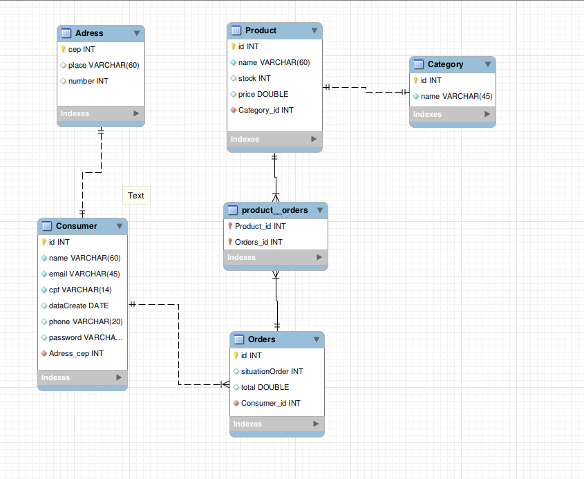

# API RESTFULL JERSEY FRAMEWORK

Api desenvolvida na linguagem de programação java e com auxílio do Jersey, Jpa, Apache Tomcat e Hibernate. Essa api possui os seguintes endpoints:

1- Adress

Acesso: http://localhost:8080/api/adress
```
{
    "cep": 40000000,
    "place": "xxxx"
}
```
2- Category

Acesso: http://localhost:8080/api/category
```
{
    "id": 1,
    "name": "brinquedo"
}
```

3- Product

Acesso: http://localhost:8080/api/product
```
{
    "category": {
      "id": 1,
      "name": "brinquedo"
    },
    "id": 1,
    "name": "boneca",
    "price": 240.0,
    "stock": 5
}
```

4- Orders

Acesso: http://localhost:8080/api/orders

```
{
    "consumer": {
      "adress": {
        "cep": 40000000,
        "place": "xxxx"
      },
      "cpf": "858.456.789-10",
      "email": "mark.zuck@facebook.com",
      "id": 1,
      "name": "mark",
      "password": "123456",
      "phone": "(71)9999-4881"
    },
    "id": 1,
    "products": [
      
    ],
    "situation": "PENDENT",
    "total": 240.0
}
```
5- Consumer

Acesso: http://localhost:8080/api/consumer
```
{
    "adress": {
      "cep": 40000000,
      "place": "xxxx"
    },
    "cpf": "158.456.789-10",
    "email": "mark.zuck@facebook.com",
    "id": 1,
    "name": "mark",
    "password": "123456",
    "phone": "(31)9999-4881"
}
```
E essas entidades estão organizadas da seguinte forma:



### 📝 Jersey
```
<dependency>
    <groupId>org.glassfish.jersey.containers</groupId>
	<artifactId>jersey-container-servlet-core</artifactId>
</dependency>
<dependency>
    <groupId>org.glassfish.jersey.media</groupId>
	<artifactId>jersey-media-json-jackson</artifactId>
</dependency>
<dependency>
	<groupId>org.glassfish.jersey.inject</groupId>
	<artifactId>jersey-hk2</artifactId>
</dependency>
<dependency>
    <groupId>org.glassfish.jersey.media</groupId>
	<artifactId>jersey-media-json-binding</artifactId>
</dependency>
```
### 📝 Hibernate

```
<dependency>
	<groupId>org.hibernate</groupId>
	<artifactId>hibernate-core</artifactId>
	<version>5.4.12.Final</version>
</dependency>
		<!-- https://mvnrepository.com/artifact/org.hibernate/hibernate-entitymanager -->
<dependency>
	<groupId>org.hibernate</groupId>
	<artifactId>hibernate-entitymanager</artifactId>
	<version>5.4.12.Final</version>
</dependency>
```

### ☕ Java

```
<configuration>
	<source>1.8</source>
	<target>1.8</target>
</configuration>
```